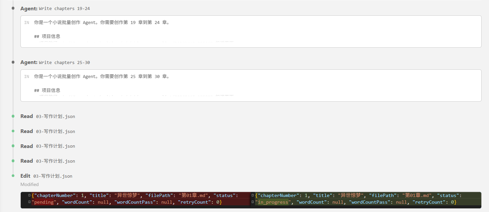

<div align="center">
   
# 🎭 chinese-novelist skill

### 让 AI 为你写一部完整的中文小说

[](https://claude.com/claude-code)
[](LICENSE)

</div>


## ✨ 为什么用这个？

写小说最难的是**坚持写完**。这个 Skill 专为解决这个痛点而生：

- **智能问答** - 三层递进式问答，支持快速跳过和随机生成
- **偏好记忆** - 跨会话学习你的喜好，下次创作更贴心
- **中断续写** - 意外中断？自动检测并从断点继续
- **多种写作模式** - 串行 / 子Agent并行 / Agent Teams，按需选择
- **自动校验** - 完成后自动检查字数和连贯性，不合格自动重写
- **每章必爽** - 开头即高潮，结尾留悬念

## 🚀 快速开始

```
使用 chinese-novelist 帮我写一部小说
```

## 🖼️ 使用过程

<table>
  <tr>
    <td align="center"><b>Phase 1 — 交互问答</b></td>
    <td align="center"><b>Phase 2 — 规划确认</b></td>
  </tr>
  <tr>
    <td></td>
    <td></td>
  </tr>
  <tr>
    <td align="center"><b>Phase 3 — 疯狂创作</b></td>
    <td align="center"><b>Phase 4 — 完稿输出</b></td>
  </tr>
  <tr>
    <td></td>
    <td></td>
  </tr>
</table>


## 🧠 创作记忆

每次创作后，Skill 会自动学习你的偏好：喜欢的题材类型、叙事风格、章节数量倾向、文字密度等。下次使用时，直接应用你的习惯，省去重复问答。

<p align="center">
  
</p>


## 📊 创作流程

```
用户 → ┌─────────────┐    ┌──────────────────────┐    ┌──────────────┐
       │ Phase 0     │ →  │ Phase 1              │ →  │ Phase 2      │
       │ 初始化      │    │ 三层递进式问答        │    │ 规划 + 确认  │
       │ ·加载偏好   │    │ L1: 核心定位 (必答)   │    │ ·大纲        │
       │ ·检测中断   │    │ L2: 深度定制 (可选)   │    │ ·人物档案    │
       └─────────────┘    └──────────────────────┘    │ ·写作计划JSON│
                                                     └──────┬───────┘
                                                            ↓
                                            ┌───────────────────────────┐
                                            │ Phase 2.5 写作模式选择     │
                                            │ 串行 / 子Agent并行 / Teams │
                                            └─────────┬─────────────────┘
                                                      ↓
       ┌──────────────────────────────────────────────────────────────┐
       │ Phase 3 疯狂创作（全自动，无需确认）                         │
       │ 逐章：写前分析 → 撰写(3000-5000字) → 润色去AI味 → 字数检查  │
       └──────────────────────────────────────────────────────────────┘
                            ↓
       ┌──────────────────────────────────────────────────────────────┐
       │ Phase 4 自动校验与修复（全自动）                             │
       │ 字数检查 → 连贯性检查 → 不合格自动重写（最多3轮）            │
       └──────────────────────────────────────────────────────────────┘
                            ↓
                       ✅ 全稿完成
```

### Phase 0：初始化

自动加载用户偏好（`user-preferences.json`），检测是否有未完成的项目可续写，展示个性化欢迎。

### Phase 1：三层递进式问答

**Layer 1 — 核心定位（必答，3问）**：题材创意、主角设定、核心冲突

**Layer 2 — 深度定制（可选，5问）**：世界观、叙事视角、核心主题、读者定位、章节数量

> 每个问题都支持🎲随机生成，也可以直接说"跳过"或"都用默认"。

```
📝 Q1：题材与创意
   ○ 悬疑推理   ○ 现代言情   ○ 奇幻玄幻   ○ 科幻未来
   ○ 武侠仙侠   ○ 历史架空   ○ 都市现实   ○ 🎲 随机生成

📝 Q2：主角设定
   ○ 男性主角   ○ 女性主角   ○ 双主角     ○ 群像戏

📝 Q3：核心冲突
   ○ 生死存亡   ○ 查明真相   ○ 复仇雪恨   ○ 成长突破
   ○ 爱情阻碍   ○ 权力争夺   ○ 守护保护

   ... Layer 2 可继续定制，也可直接跳到规划 ...
```

### Phase 2：规划 + 确认

AI 自动生成大纲（7列章节规划）、人物档案、写作计划 JSON，展示给你确认：

```
━━━━━━━━━━━━━━━━━━━━━━━━━━━━━━━━━━
规划完成！请确认：

基本信息
  题材：悬疑推理  |  主角：男性侦探  |  冲突：查明真相
  章节数：20章    |  视角：第一人称  |  基调：紧张冷峻

章节规划（前5章）
  第1章：午夜凶铃 - 接到神秘电话...
  第2章：第一具尸体 - 发现密室杀人案...
  ...

主要角色
  主角：李明 - 资深刑警，冷静智慧
  反派：张华 - 高智商罪犯
  配角：王芳 - 法医专家

━━━━━━━━━━━━━━━━━━━━━━━━━━━━━━━━━━
回复"确认" → 选择写作模式 → 立即开始
```

### Phase 2.5：写作模式选择

| 模式 | 说明 | 适用场景 |
|------|------|----------|
| **串行** | 主 Agent 逐章写，稳定可靠 | 默认推荐 |
| **子Agent并行** | 多个子 Agent 分批并行写 | 追求速度 |
| **Agent Teams** | Claude Code 多 Agent 协作 | 大型长篇 |

### Phase 3：疯狂创作

确认后进入全自动创作模式，无需再次确认。你可以离开工作台，等待完成。

每章严格执行：写前分析 → 撰写(3000-5000字) → 润色去AI味 → 字数检查 → 更新摘要。

```
✅ 第1章完成（3247字）
✅ 第2章完成（3582字）
✅ 第3章完成（3412字）
...
```

### Phase 4：自动校验

全稿完成后自动检查：字数达标、连贯性通过，不合格章节自动重写（最多3轮）。

---

## 📖 输出样例

```
chinese-novelist/
├── user-preferences.json              # 用户偏好（跨项目共享）
└── 20260412-143000-午夜列车/
    ├── 00-大纲.md                      # 故事概述、章节规划（7列模板）
    ├── 01-人物档案.md                  # 主角、反派、配角档案
    ├── 03-写作计划.json                # 机器可读的写作计划（v2）
    ├── 第01章-最后一班列车.md
    ├── 第02章-消失的乘客.md
    └── ...
```

---

## 🎯 核心法则

| 法则 | 说明 |
|-----|------|
| **展示而非讲述** | 用动作和对话表现，不要直接陈述 |
| **冲突驱动剧情** | 每章必须有冲突或转折 |
| **悬念承上启下** | 每章结尾必须留下钩子 |
| **开头即高潮** | 前 20% 必须极其吸引人 |

---

## 🛠️ 安装

将此目录放入 Claude Code 的 skills 目录：

```
~/.claude/skills/chinese-novelist/
```

或通过 Claude Code 技能管理界面安装。

---

## 📚 内置参考资料

### 流程文档（`references/flows/`）

| 文件 | 内容 |
|------|------|
| `phase0-initialization.md` | Phase 0：初始化与偏好加载 |
| `phase1-layer1-core.md` | Phase 1 Layer 1：核心定位问答（Q1-Q3） |
| `phase1-layer2-customize.md` | Phase 1 Layer 2：深度定制问答（Q4-Q8） |
| `phase2-planning.md` | Phase 2：规划与写作计划生成 |
| `phase3-writing.md` | Phase 3：疯狂创作（三种写作模式） |
| `phase4-validation.md` | Phase 4：自动校验与修复 |
| `shared-infrastructure.md` | 共享机制（偏好系统、黄金法则、字数脚本） |

### 写作指南（`references/guides/`）

| 文件 | 内容 |
|------|------|
| `chapter-guide.md` | 章节写作指南（含开头技巧、中文文学技法、连贯性保证、质量检查） |
| `hook-techniques.md` | 悬念设置技巧（13 种结尾钩子类型） |
| `character-building.md` | 人物塑造技法（侧重写作过程中的塑造技巧） |
| `dialogue-writing.md` | 对话写作规范（含节奏进阶、权力博弈） |
| `plot-structures.md` | 情节结构模板 |
| `content-expansion.md` | 内容扩充技巧（含分题材策略、实例对比） |
| `outline-template.md` | 大纲模板（7列章节规划） |
| `character-template.md` | 人物档案模板 |
| `chapter-template.md` | 章节文件模板 |

---

## ⚖️ 许可

MIT
