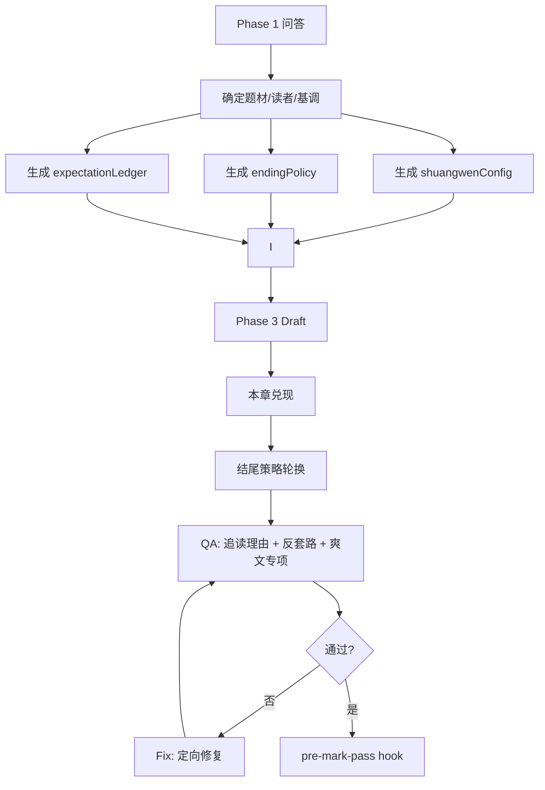

# 一、修改历史

| 版本 | 变更日期 | 变更人 | 变更内容 |
| --- | --- | --- | --- |
| v0.1 | 2026-05-06 | Claude | 初稿：新增爽文模式 |
| v0.2 | 2026-05-06 | Codex | 优化：降低模式化结尾，引入爽文节拍、期待管理和高热网文参考 |
| v0.3 | 2026-05-06 | Codex | 调整：取消 `contentMode` 分流，所有小说默认执行爽文专项 |

# 二、项目背景

**PRD：** 暂无（用户需求：优化 chinese-novelist-skill，让小说更吸引人、轻松好读，所有小说默认符合爽文标准，并避免机械化写法）

**接口文档：** 暂无

**外部参考：**
- [起点中文网排行榜](https://www.qidian.com/rank/)：平台按畅销、阅读指数、分类等维度组织高热作品，用于参考“高阅读作品不是单一套路，而是题材、节奏、读者期待的组合”。
- [2024 阅文 IP 盛典榜单报道](https://www.fromgeek.com/internet/50-675264.html)：年度影响力作品覆盖玄幻、科幻、都市、仙侠、轻小说等题材，并以月票等读者行为作为重要衡量。
- [爽文定义参考](https://zh.wikipedia.org/wiki/%E7%88%BD%E6%96%87)：爽文核心是即时畅快地满足读者愿望，而不是单纯制造悬念。
- [WebNovelBench](https://arxiv.org/abs/2505.14818)：长篇网文生成评估需要多维叙事质量，而不是单一指标；该论文使用 4000+ 中文网文数据和多维评价框架。

**背景说明：**
当前仓库已经具备 Novel Harness 闭环：递进式问答、规划生成、章节写作、三轮 QA、反 AI、追读力门禁、自动修复复检、Claude/Codex hooks、flow smoke test。现阶段的问题不是“缺少检查”，而是“检查标准会诱导模式化”。

典型表现：

1. **每章结尾都被写成显性钩子**
   当前流程反复强调 `chapterTurnPageHook`，模型容易理解成“每章最后一句都要抛谜题/危险/黑影/手机响”。结果读者会很快识别套路，阅读体验变得廉价。

2. **爽文被误解成固定数量爽点**
   初稿方案提出“每章至少 3-5 个爽点”，这会把写作变成打点清单。真实高热网文更重要的是：读者在某个阶段获得情绪兑现，并相信后面还有更大的兑现。

3. **爽文被做成可选模式**
   现有 `writingMode` 表示执行方式（serial / subagent-parallel / agent-teams）。爽文也不应再作为 `contentMode` 分流；它应成为所有小说的基础吸引力标准。

4. **缺少防套路机制**
   目前有“必须有钩子”，但没有“钩子不能连续同型”“不能每章都悬而不决”“不能只铺垫不兑现”的反模式约束。

**目标：**
- 不新增 `contentMode`；所有小说默认执行爽文专项。
- 用“期待管理”替代“每章固定钩子”：章节结尾可以是悬念、兑现、余味、选择、反差、阶段收束，不强制每章都吊胃口。
- 将爽文标准从“固定数量爽点”改为“爽点节拍 + 情绪兑现 + 升级可见 + 读者期待升级”，并作为所有小说的默认验收项。
- 将高热网文的可执行经验沉淀为模板、QA 门禁和 hook 可识别字段。
- 保留反 AI 与文学质量底线，不把爽文写成模板化流水账。

**非目标：**
- 不把爽文标准做成可选模式或额外分支。
- 不把爽文模式等同于低质量、低智反派、无脑打脸。
- 不取消章节期待感，只取消机械化结尾钩子。
- 不依赖外部平台实时抓榜；外部参考只用于设计原则，不作为运行时依赖。

# 三、需求细分

| 需求点 | 说明 | 优先级 | 依赖/约束 | 验收口径 |
| --- | --- | --- | --- | --- |
| 结尾策略轮换 | 用 `endingStrategy` 替代“每章硬钩子” | P0 | 修改 chapter contract、reader hook、QA | 连续章节不能使用同一类强悬念结尾 |
| 期待管理系统 | 新增 `expectationLedger`，记录本章兑现与下章期待 | P0 | 修改 outline、summary、continuity | 每章必须有兑现，未必必须有悬念 |
| 爽文标准内置 | 新增 `shuangwenConfig`，定义强度、节拍和兑现方式 | P0 | 修改 Phase 2/3/QA | 所有小说的规划、写作、QA 都读取该配置 |
| 爽文指南 | 新增 `shuangwen-writing-guide.md` | P0 | 新增 guide | 覆盖升级流、打脸流、无敌流、重生流、经营流、都市神豪流 |
| 反套路门禁 | 新增机械化检测：结尾同质、只铺不兑、震惊模板、低智反派 | P0 | 修改 QA 模板和 reader-hook-gate | QA 报告出现 M-XX/S-XX 问题时不得 pass |
| 爽文 QA | 增加爽文专项 S-XX，但不改成固定爽点计数 | P0 | 修改 qa-report-template | QA 能判断爽感成立与否，并给修复指令 |
| Hook 适配 | pre-mark-pass 检查爽文专项字段 | P1 | 修改 novel_hook_guard.py | 任一项目缺 `satisfactionBeats`、`shuangwenStatus` 或有 S-XX 阻塞项时失败 |
| Smoke 测试 | 增加爽文/机械结尾 fixture | P1 | 修改 smoke_novel_flow.py | 能拦住每章机械钩子、爽文未兑现、缺专项 QA |

# 四、方案设计

## 1. 方案一(主) — 期待管理 + 默认爽文节拍

### 方案概述

主方案不把爽文做成新的执行模式，也不再做成可选内容模式。`writingMode` 仍只表示串行、并行或 Teams；爽文专项是所有小说的默认质量门禁：

```json
{
  "writingMode": "serial",
  "executionMode": "serial",
  "shuangwenConfig": {
    "cadence": "每章至少一次有效情绪兑现，但不固定爽点数量"
  }
}
```

其中：
- `writingMode` 或 `executionMode`：负责串行、并行、Teams。
- `shuangwenConfig`：负责爽点节拍、情绪兑现、升级可见和阶段性大兑现。

核心设计从“每章必须有钩子”改为：

```text
本章兑现一个期待 -> 制造或升级一个后续期待 -> 结尾形式轮换 -> QA 检查是否自然
```

所有小说使用“爽点节拍”而不是硬性计数：

```text
压迫/误判 -> 主角行动 -> 局部兑现 -> 反应反馈 -> 更大期待
```

这能解决两个问题：
- 不再每章机械结尾。
- 爽文仍能持续提供阅读快感。

### 系统影响范围

| 系统/模块 | 变更内容 | 风险等级 |
| --- | --- | --- |
| SKILL.md | 增加默认爽文专项、结尾反套路说明 | 低 |
| phase1-layer2-customize.md | 不再询问爽文模式，所有小说默认执行爽文专项 | 低 |
| phase2-planning.md | JSON 模板增加 `shuangwenConfig`、`endingPolicy` | 中 |
| outline-template.md | 增加期待兑现表、爽文节拍表、结尾策略列 | 中 |
| chapter-contract-template.md | 增加 `endingStrategy`、`payoffRequired`、`expectationNext` | 中 |
| chapter-template.md | 章节模板改为“收束/余味/期待”而非固定悬念 | 低 |
| reader-hook-gate.md | 将“结尾钩子”改为“追读理由”，增加机械化结尾 M-XX | 中 |
| qa-report-template.md | 增加结尾类型检查、爽文专项 S-XX、机械化 M-XX | 中 |
| phase3-writing.md | Draft 阶段读取 endingPolicy 和 shuangwenConfig | 中 |
| phase4-validation.md | 检查全书结尾类型分布和爽点节拍分布 | 中 |
| novel_hook_guard.py | pre-mark-pass 检查 `endingStrategy`、`expectationPayoff`、爽文专项 | 中 |
| smoke_novel_flow.py | 增加机械结尾和爽文专项 fixture | 低 |

### 流程设计



### 核心数据结构

#### 1. 写作计划扩展

```json
{
  "writingMode": "serial",
  "contentProfile": {
    "targetReader": "网络爽文读者",
    "pace": "fast",
    "payoffStyle": "frequent-but-varied",
    "antiFormulaic": true
  },
  "endingPolicy": {
    "avoidSameEndingTypeInRecentChapters": 2,
    "maxHardCliffhangerRatio": 0.35,
    "allowedEndingTypes": [
      "payoff-close",
      "soft-question",
      "decision-point",
      "emotional-aftertaste",
      "resource-reveal",
      "relationship-shift",
      "threat-approach"
    ]
  },
  "shuangwenConfig": {
    "enabled": true,
    "type": "upgrade-flow",
    "intensity": "medium",
    "payoffCadence": "minor-every-chapter-major-every-2-to-3",
    "oppressionMaxWords": 600,
    "majorPayoffInterval": 3,
    "upgradeVisibleInterval": 3,
    "goldenFingerType": "system",
    "forbiddenPatterns": [
      "连续三章只抛悬念不兑现",
      "每章最后一句都是黑影/电话/敲门",
      "反派无脑辱骂后秒跪",
      "围观群众只会震惊"
    ]
  }
}
```

#### 2. 章节级字段

```json
{
  "endingStrategy": "payoff-close",
  "endingIntensity": 1,
  "expectationPayoff": "兑现第3章埋下的资源争夺",
  "expectationNext": "读者想看主角如何利用新资源改变地位",
  "satisfactionBeats": [
    {
      "type": "resource-gain",
      "position": "middle",
      "effect": "主角拿到关键资源",
      "visibleReaction": "对手误判失败"
    }
  ],
  "shuangwenStatus": "pass",
  "formulaicIssues": []
}
```

### 重点难点与伪代码

#### 1. 爽文节拍配置生成

```java
public class ShuangwenConfigBuilder {

    public ShuangwenConfig build(PhaseAnswers answers) {
        String tone = answers.getTone();
        String targetReader = answers.getTargetReader();
        String special = answers.getSpecialRequirements();

        return ShuangwenConfig.defaultFor(tone, targetReader, special)
            .withCadence("minor-every-chapter-major-every-2-to-3")
            .withRule("satisfactionBeats must be non-empty");
    }
}
```

#### 2. 结尾策略选择

目标：避免每章结尾都“硬钩子”。

```java
public class EndingStrategySelector {

    public EndingStrategy select(ChapterContext context, EndingPolicy policy) {
        List<EndingStrategy> recent = context.getRecentEndingStrategies(2);
        List<EndingStrategy> candidates = policy.getAllowedEndingTypes();

        candidates.removeAll(recent);

        if (context.hasMajorPayoffInThisChapter()) {
            return EndingStrategy.PAYOFF_CLOSE;
        }

        if (context.nextChapterStartsWithChoice()) {
            return EndingStrategy.DECISION_POINT;
        }

        if (context.relationshipChanged()) {
            return EndingStrategy.RELATIONSHIP_SHIFT;
        }

        if (context.hasNewResourceOrClue()) {
            return EndingStrategy.RESOURCE_REVEAL;
        }

        return EndingStrategy.SOFT_QUESTION;
    }
}
```

#### 3. 爽文节拍校验

不是固定每章 3 个爽点，而是检查“读者是否获得情绪兑现”。

```java
public class ShuangwenCadenceChecker {

    public List<Issue> check(Chapter chapter, ShuangwenConfig config) {
        List<Issue> issues = new ArrayList<>();

        if (chapter.getOppressionWords() > config.getOppressionMaxWords()
                && !chapter.hasPayoffAfterOppression()) {
            issues.add(Issue.block("S-01", "憋屈过长且没有及时兑现"));
        }

        if (!chapter.hasAnySatisfactionBeat()) {
            issues.add(Issue.block("S-02", "本章没有有效爽点节拍"));
        }

        if (chapter.isMajorPayoffDue(config.getMajorPayoffInterval())
                && !chapter.hasMajorPayoff()) {
            issues.add(Issue.block("S-03", "大爽点或阶段兑现逾期"));
        }

        if (chapter.isUpgradeDue(config.getUpgradeVisibleInterval())
                && !chapter.hasVisibleUpgrade()) {
            issues.add(Issue.block("S-04", "主角能力/地位/资源升级不可见"));
        }

        if (chapter.hasLowIqAntagonistOnly()) {
            issues.add(Issue.warn("S-05", "对手过低智，爽感廉价"));
        }

        return issues;
    }
}
```

#### 4. 机械化结尾校验

```java
public class FormulaicEndingChecker {

    public List<Issue> check(List<Chapter> recentChapters) {
        List<Issue> issues = new ArrayList<>();

        if (sameEndingTypeCount(recentChapters, 3) >= 3) {
            issues.add(Issue.block("M-01", "连续三章使用同类结尾"));
        }

        if (hardCliffhangerRatio(recentChapters) > 0.35) {
            issues.add(Issue.block("M-02", "强悬念结尾占比过高"));
        }

        if (hasRepeatedLastLinePattern(recentChapters)) {
            issues.add(Issue.block("M-03", "结尾句式重复，读者可预测"));
        }

        if (hasSetupWithoutPayoff(recentChapters, 3)) {
            issues.add(Issue.block("M-04", "连续铺垫但缺少兑现"));
        }

        return issues;
    }
}
```

### 接口设计

无 HTTP/RPC 接口。全部为本地文档、JSON 字段、hook 脚本和 smoke fixture 修改。

### 幂等、并发与一致性

- `shuangwenConfig` 为推荐配置字段；即使旧项目缺失，章节级 `satisfactionBeats`、`shuangwenStatus`、`shuangwenIssues` 仍作为硬门禁。
- `writingMode` 保持执行语义，不再承载内容类型，避免并行模式兼容问题。
- 并行写作时，子 Agent 只写负责章节的 `endingStrategy` 和 `satisfactionBeats`，全局的结尾类型分布由 State Keeper 合并校验。

### 数据量、性能与扩展性

新增字段主要进入 `02-写作计划.json`、章节契约和 QA 报告。对性能无实际影响。hook 增加少量 JSON 字段校验，不读取全章节正文做复杂分析，避免 Stop 阶段过慢。

### 原有逻辑兼容

- 旧项目不再按“非爽文模式”放宽；完成章节必须补齐爽文专项字段。
- `chapterTurnPageHook` 不删除，但语义从“悬念钩子”改为“追读理由”，允许“已兑现后的余味”和“下一步期待”。
- 爽文专项不会降低反 AI 标准。

# 五、文件级详细变更清单

## 1. Phase 1：问答层

不再增加“内容取向/爽文模式”问题。Phase 1 只收集题材、目标读者、基调和特殊要求；Phase 2 根据这些信息自动生成爽文节拍配置。

## 2. Phase 2：规划层

`02-写作计划.json` 增加：

```json
{
  "endingPolicy": {
    "avoidSameEndingTypeInRecentChapters": 2,
    "maxHardCliffhangerRatio": 0.35
  },
  "shuangwenConfig": {
    "enabled": true,
    "type": "upgrade-flow",
    "intensity": "medium",
    "oppressionMaxWords": 600,
    "majorPayoffInterval": 3,
    "upgradeVisibleInterval": 3
  }
}
```

大纲模板新增两列：

| 字段 | 说明 |
| --- | --- |
| 本章兑现 | 本章解决、获得、打脸或推进了什么 |
| 结尾策略 | payoff-close / soft-question / decision-point / emotional-aftertaste / resource-reveal / relationship-shift / threat-approach |

## 3. 章节契约

`chapter-contract-template.md` 增加：

```markdown
## 期待与结尾策略

- **本章必须兑现**：[上一章或本弧段承诺的期待]
- **本章结尾类型**：[endingStrategy]
- **结尾强度**：0-3
- **下一章期待**：[读者读完后想看的具体内容]
- **禁止**：连续使用同类强悬念结尾；禁止只抛问题不兑现。
```

## 4. 写作阶段

`phase3-writing.md` 的 Draft 阶段增加：

```markdown
### 结尾反套路要求

- 本章结尾优先服务 `endingStrategy`，不是默认制造悬念。
- 如果本章已经完成大爽点或关键兑现，允许用余味式、收束式、关系变化式结尾。
- 强悬念结尾不得连续使用超过 2 章。
- 禁止使用重复句式：黑影、电话、敲门、系统提示、门外有人等机械结尾。
```

爽文专项增加：

```markdown
### 爽文专项要求

- 本章必须有至少 1 个有效 satisfactionBeat。
- 憋屈/压迫段落超过 `oppressionMaxWords` 时，必须在本章内给出局部兑现。
- 到达 `majorPayoffInterval` 时必须给大爽点或阶段性打脸。
- 到达 `upgradeVisibleInterval` 时必须让主角能力、地位、资源或认知产生可见变化。
- 对手不能只靠低智辱骂制造爽感；必须有让主角胜利更有价值的阻力。
```

## 5. QA 模板

新增机械化检查：

| 编号 | 类型 | 阻塞 |
| --- | --- | --- |
| M-01 | 连续章节同类结尾 | 是 |
| M-02 | 强悬念结尾占比过高 | 是 |
| M-03 | 结尾句式重复 | 是 |
| M-04 | 连续铺垫不兑现 | 是 |
| M-05 | 追读理由只靠“下一章会发生事” | 否 |

新增爽文专项：

| 编号 | 类型 | 阻塞 |
| --- | --- | --- |
| S-01 | 憋屈过长且无兑现 | 是 |
| S-02 | 本章无有效爽点节拍 | 是 |
| S-03 | 大爽点/阶段兑现逾期 | 是 |
| S-04 | 主角升级不可见 | 是 |
| S-05 | 对手低智导致爽感廉价 | 否 |
| S-06 | 金手指或信息差没有参与情节 | 否 |
| S-07 | 爽点只有结果，没有过程和反应 | 否 |

## 6. reader-hook-gate

将“结尾钩子”改名为“追读理由”：

```text
chapterTurnPageHook = 读者继续读下一章的具体理由
```

允许以下追读理由：

- 未解决问题
- 新资源如何使用
- 关系变化后会怎样
- 主角刚兑现后带来的余味
- 新选择的代价
- 更大舞台的门被打开

## 7. novel_hook_guard.py

pre-mark-pass 增加字段校验：

```python
if chapter.get("endingStrategy") is None:
    add_issue("missing-ending-strategy")

if not chapter.get("expectationPayoff"):
    add_issue("missing-expectation-payoff")

if content_mode == "shuangwen":
    if chapter.get("shuangwenStatus") != "pass":
        add_issue("shuangwen-not-pass")
    if chapter.get("shuangwenIssues"):
        add_issue("shuangwen-issues-exist")
```

Stop hook 增加全书分布检查：

```python
if hard_cliffhanger_ratio > maxHardCliffhangerRatio:
    block("hard-cliffhanger-ratio-too-high")

if has_three_same_ending_strategy_in_a_row:
    block("ending-strategy-repeated")
```

## 8. smoke_novel_flow.py

新增 fixture：

| fixture | 预期 |
| --- | --- |
| fixture-formulaic-ending | stop FAIL |
| fixture-shuangwen-no-payoff | pre-mark-pass FAIL |
| fixture-satisfaction-pass | pre-mark-pass PASS |

# 六、测试方案

| 测试类型 | 测试重点 | 覆盖范围 |
| --- | --- | --- |
| 单章通过 | 非悬念结尾也可通过，但必须有 satisfactionBeat | pre-mark-pass |
| 机械结尾 | 连续三章 hard-cliffhanger | stop FAIL |
| 爽文通过 | 有 satisfactionBeat、兑现、升级可见 | pre-mark-pass PASS |
| 爽文失败 | 长憋屈无兑现 | pre-mark-pass FAIL |
| 回归 | 原有 fixture-pass / no-qa / needs-recheck / low-score / blocked | smoke_novel_flow.py |

一键验证：

```bash
python scripts/smoke_novel_flow.py
```

# 七、上线方案

## 第一批：修正方案和模板

- [ ] 修改 Phase 2，新增 `endingPolicy`、`shuangwenConfig`
- [ ] 修改大纲和章节契约模板，加入期待兑现与结尾策略
- [ ] 新增 `shuangwen-writing-guide.md`

## 第二批：写作与 QA

- [ ] 修改 Phase 3，加入结尾反套路与爽文节拍要求
- [ ] 修改 reader-hook-gate 和 qa-report-template
- [ ] 修改 literary-quality-gate，增加爽文但不降低质量标准

## 第三批：Hook 与回归

- [ ] 修改 novel_hook_guard.py
- [ ] 修改 smoke_novel_flow.py
- [ ] 运行完整 smoke test

# 八、运维方案

无线上运维。运行时保障依赖：

- `AGENTS.md` / `CLAUDE.md`
- `.claude/settings.json`
- `.codex/hooks.json`
- `scripts/novel_hook_guard.py`
- `scripts/smoke_novel_flow.py`

修改后观察：

| 观察项 | 预期 | 异常处理 |
| --- | --- | --- |
| 章节结尾类型分布 | 不连续同型 | 调整 endingPolicy |
| 爽文节拍 | 每章有兑现，2-3 章有阶段大兑现 | 修复 shuangwenConfig 或大纲 |
| QA 问题 | M-XX/S-XX 可定位可修复 | 优化 QA 模板 |
| 用户体感 | 不再每章机械钩子，阅读更自然 | 调整反套路门禁 |

# 九、问题记录

| 问题 | 当前判断/推荐答案 | 状态 |
| --- | --- | --- |
| 爽文是否应作为 writingMode 或 contentMode？ | 不应。writingMode 是执行模式，爽文也不再作为 contentMode；爽文专项是所有小说默认门禁。 | 已决策 |
| 每章是否必须结尾钩子？ | 不应。必须有追读理由，但结尾形式应轮换，允许收束和余味。 | 已决策 |
| 爽文是否必须每章 3-5 个爽点？ | 不应硬性计数。改为 `satisfactionBeat` 和阶段兑现节拍。 | 已决策 |
| 爽文是否降低文学质量？ | 不降低。爽文增加类型要求，反 AI 与文学门禁保持。 | 已决策 |
| 是否依赖互联网榜单实时数据？ | 不依赖。外部榜单只作为设计参考，运行时不抓取。 | 已决策 |
